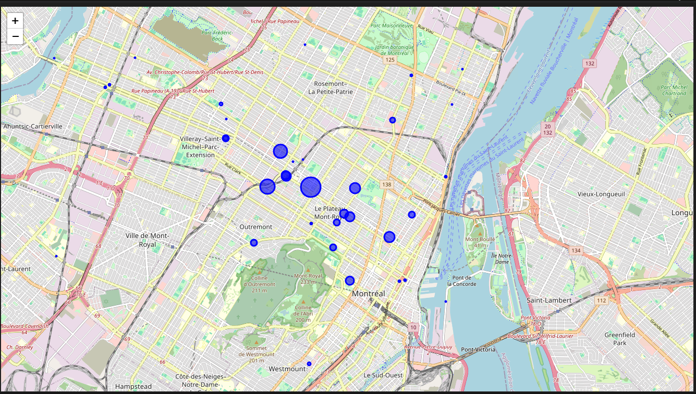

# Analyse du trafic de vélos à Montréal en 2025 à partir des données de comptage

## Description

Ce projet explore le trafic cycliste à Montréal en 2025 à l’aide des données ouvertes publiées par la Ville. Il s’appuie sur les données de comptage automatisé des passages de vélos sur les pistes cyclables, permettant de visualiser les tendances horaires, journalières et géographiques.

---

## Objectifs

- Étudier l'évolution quotidienne et horaire du trafic de vélos
- Analyser la variation du trafic par mois et par jour de la semaine
- Localiser les zones les plus actives à l’aide des coordonnées GPS
- Visualiser les données sur une carte interactive avec `Folium`

---

## Données

Les données utilisées proviennent du portail
- **Données Montréal** :  
[https://donnees.montreal.ca/dataset/velos-comptage](https://donnees.montreal.ca/dataset/velos-comptage)

Fichier principal :
- `comptage_velo_2025.csv` : données de passage journalier par compteur

Colonnes clés :
- `date`, `heure`, `id_compteur`, `nb_passages`, `latitude`, `longitude`

---

## Technologies utilisées

- Python 3
- Pandas
- Matplotlib
- numpy
- Folium (carte interactive)

---

## Analyses et Visualisations réalisées

- **Analyse par jour** : volume quotidien et identification des pics de fréquentation
-  **Analyse horaire** : variation des passages à chaque heure de la journée
-  **Jour de la semaine** : comparaison des moyennes entre jours ouvrables et week-ends
- **Analyse géographique** :
  - Répartition des compteurs par latitude/longitude
  - Visualisation sur carte interactive avec Folium

---
## Carte interactive

Une carte interactive affiche les compteurs de la ville, avec des cercles proportionnels au volume total de passages.

> Titre : **Répartition géographique du trafic cycliste à Montréal selon les compteurs (2025)**

---

## Résultats clés

- Plus de 30 000 passages en une seule journée sur certains pics (ex : 19 mars)
- Heures de pointe cycliste typiques : entre 7h–9h et 16h–18h
- Forte activité sur des compteurs situés au centre-ville et dans les quartiers densément cyclables

---

## Améliorations futures

- Intégration des données météo pour corrélation avec la fréquentation
- Comparaison interannuelle (2024 vs 2025)
---

## Auteur

# Adlin Louisama  
Ce projet a été réalisé dans le cadre de ma formation à la certification **IBM Data Analyst**, dans un objectif d’apprentissage approfondi des techniques de traitement, d’analyse et de visualisation de données avec **Python**.  
Il s’appuie sur les données ouvertes de la Ville de Montréal pour mettre en pratique les compétences en data wrangling, exploration temporelle et géospatiale.
